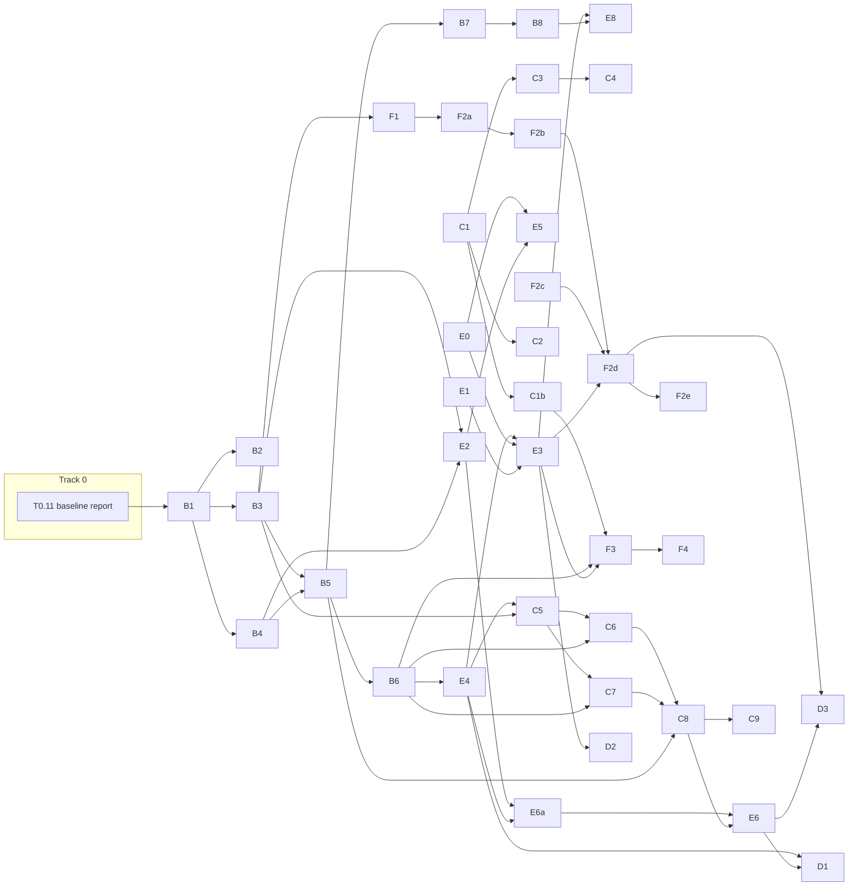

# dxtb restructuring: design goals and action plan

This is the top-level document of the action plan. It states what dxtb should be able to do, the principles every change follows, and how the work is split into tracks. Each track has its own file with work packages.

| File | Track | Purpose |
| --- | --- | --- |
| `00-overview.md` | none | Goals, principles, track map, dependencies, releases |
| `01-T0-baseline.md` | T0 | Everything tested, measured or fixed before any refactor starts |
| `02-TB-evaluation-api.md` | TB | Model/system/result split, results instead of caches, fields as inputs |
| `03-TC-node-migration.md` | TC | Replace `TensorLike` with frozen pytree nodes; retire `TensorLike` |
| `04-TE-differentiable-core.md` | TE | Higher-order and forward-mode derivatives, static shapes, batching through `vmap` |
| `05-TF-machine-learning.md` | TF | Parameter training (including new elements) and ML terms in the SCF |
| `06-TD-performance.md` | TD | Compiling and other performance work, driven by measurements |

Code references point to upstream `grimme-lab/dxtb` main at commit `46af7bc`. Line numbers may shift. Package IDs in these files supersede the IDs used in earlier review discussions.

---

## 1. Design goals

### G1: Higher-order derivatives

Compute third-order quantities reliably and at reasonable cost:

- third-order geometric force constants (∂³E/∂R³);
- first and second hyperpolarizabilities (∂³E/∂F³ and higher);
- mixed derivatives with respect to geometry, field and parameters (dipole and polarizability derivatives for IR and Raman; derivatives of forces with respect to parameters, for force matching).

**Acceptance:** for GFN1 and GFN2 on the reference set (T0.2), third-order geometric derivatives match finite differences of analytical Hessians, and hyperpolarizabilities match finite differences of polarizabilities, within tolerances fixed in T0.3. Forward-mode derivatives (`jvp`, `jacfwd`) work end to end.

### G2: Efficient batching

Two cases:

- **Conformer ensembles** (CREST-style): same composition, many geometries. One system, batched positions.
- **Mixed-composition batches** for training: padded and stacked systems.

**Acceptance:**

- conformer throughput at least matches the current `batch_mode = 2` on the T0.8 workloads (target fixed after T0.8);
- per-system derivatives contain no cross-system blocks;
- no per-entry Python loops in the per-call path.

### G3: Parameter learning, including new elements

- Train existing GFN1 and GFN2 parameters against reference data.
- Create parametrizations for new elements (actinides, Z = 89–103): start from defaults, train on a reference set, export a parameter file.
- Elements 1–86 stay bit-identical unless explicitly trained.

**Acceptance:** a documented workflow takes a default parameter file and a dataset to trained actinide parameters. A held-out validation passes, and parameters for elements 1–86 are verifiably unchanged.

### G4: ML contributions in the SCF

A machine-learned contribution to the Fock matrix:

- defined through an energy, so that forces and derivatives are consistent;
- trainable jointly with physical parameters;
- usable with batching and higher-order derivatives.

**Acceptance:** an example ML term converges in the SCF, its forces match finite differences, and its weights train with `torch.func`.

### G5 (secondary): Performance through compiling

Compiling is used where measurements show a benefit (TD). It is not a goal in itself and never drives design decisions against G1–G4.

### Non-goals

- Backward compatibility of the Python API. Breaking changes are allowed and are collected into at most two releases (section 8).
- Float32 for the physics. Higher-order derivatives and SCF convergence need float64.
- Removing libcint, unless E0 shows it blocks G1 or G2.

---

## 2. Constraints

- **Precision.** Float64 throughout the physics. ML components run in float64, or cast internally and return float64.
- **Python.** Python ≥ 3.10 once `Node` lands (frozen `kw_only` dataclasses).
- **Torch.** torch ≥ 2.4 for eager use. The minimum version for compiled use is decided in TD.
- **Coordinated releases.** dxtb pins tad-dftd3 0.6.0, tad-dftd4 0.8.0, tad-mctc 0.7.0 and tad-multicharge 0.5.0 exactly, and these packages pin `tad-mctc==0.7.0`. tad-* releases can therefore break APIs without breaking existing installs, but dxtb must update them in lockstep.
- **Pytrees, not `nn.Module`.** Containers are frozen dataclasses registered as pytrees (`Node`). `nn.Module` was rejected because of in-place conversion, inferred dtype, mutation of shared Parameters and poor fit with `torch.func`. User-supplied `nn.Module`s (ML terms) are wrapped (C1b).

---

## 3. Architecture principles

Every work package follows these principles. Reviews check against them.

**P1. Three levels: model, system, result.**

- **Model:** parameters and frozen settings, independent of any molecule. Holds per-element tables. Shared by many systems.
- **System:** `model.setup(numbers)`. Holds everything that depends only on `numbers` (index helper, basis, gathered parameters, classical setup data). A pure function of parameters and numbers.
- **Result:** `system.singlepoint(positions, chrg, spin, field, field_grad)`. A frozen object with energies and SCF outputs.

**P2. Single-system core; batching through `vmap`.**

- Physics code handles one system, possibly padded, with no batch dimension.
- Conformers: `vmap(f, in_dims=(None, 0))(system, positions)`.
- Mixed sets: stacked padded systems, `in_dims=(0, 0)`.
- Hand-written batching exists only in the SCF driver loop and inside batching rules for operations `vmap` can't handle (C extensions, custom autograd functions).

**P3. Setup path versus per-call path.**

- Data-dependent operations (`unique`, `nonzero`, boolean indexing, anything that decides array shapes) are allowed only in setup.
- The per-call path has fixed shapes for a given composition. Distance cutoffs are masks, not shape decisions.

**P4. No hidden state.**

- No persistent caches, and no mutation after construction.
- Objects are frozen; changes go through `replace()` or construction.
- Anything reused across calls is an explicit value: the system or the result.

**P5. External perturbations are inputs.** Positions, total charge, spin, electric field and field gradient are arguments of `singlepoint`, never mutable component state.

**P6. Every term is defined by an energy.** Every contribution, including ML terms, defines an energy. Potentials and Fock contributions are derivatives of that energy, analytic or by autograd, and must be consistent with it.

**P7. Differentiable to third order, including forward mode.** Every operation on the per-call path supports reverse mode to third order, forward mode and `vmap`. Custom autograd functions provide `jvp` and vmap rules, or are replaced by plain torch code.

**P8. Padding is safe.** Masked terms use the double-`where` pattern, so derivatives stay finite to third order on padded systems.

**P9. Per-molecule values are tensors.** Pytree context holds only method-level settings, never per-molecule values. Systems with different compositions then have identical tree structure and can be stacked.

**P10. Measure first.** No optimisation without a profile (T0.8). Compiling targets the SCF step and the outermost transformed function, never the inside of an autograd chain.

---

## 4. Target API sketch (illustrative)

B1 makes the binding decision. This sketch only shows the shape implied by P1–P5.

```python
import torch
import dxtb

model = dxtb.GFN2(dtype=torch.float64, device=device)   # parameters + settings
system = model.setup(numbers)                            # numbers-only data

res = system.singlepoint(positions, chrg=0, spin=0)      # frozen result
res.energy, res.charges, res.density

f = dxtb.forces(system, positions)                       # property functions
k3 = dxtb.third_order(system, positions)                 # torch.func underneath
beta = dxtb.hyperpolarizability(system, positions, field=torch.zeros(3))

# conformers: one system, batched positions
energies = torch.func.vmap(system.energy, in_dims=0)(conformers)

# training: parameters are pytree leaves of the model
params, rest = dxtb.partition(model, trainable)
loss = lambda p: ((dxtb.combine(p, rest).setup(numbers).energy(positions) - e_ref) ** 2)
grads = torch.func.grad(loss)(params)
```

---

## 5. What gets removed

| Removed | Replaced by | Package |
| --- | --- | --- |
| `TensorLike`, `ModuleLike`, `_clone_tensorlike` | `Node` | TC |
| `batch_mode` 0/1/2, shape-based mode guessing, per-entry driver loops | single-system core plus `vmap` | E6 |
| `CalculatorCache`, `@cdec.cache`, `opts.cache`, `store_*` flags | result object | B5 |
| `Component._cache`, `_cachevars`, `cache_is_latest`, `cache_enable`/`disable`, `update`, `reset` | per-call values, `replace()` | B6 |
| `IntDriver.is_latest`, `_positions`, stored setup state | setup returns a value | B6 |
| Electric field as a mutable component, `update_efield`, `requires_efield*` decorators | fields as inputs | B7 |
| `IndexHelper.cull`/`restore`, cache `cull`/`restore` | masked SCF loop | E4 |
| `unique_shell_pairs`, per-pair Python loop in the overlap | fixed-shape pair kernels | E2 |
| Calculator mixins (analytical, autograd, numerical) | property functions | B8 |
| Vendored xitorch implicit SCF | decided in E0 | E3 |

---

## 6. Tracks

| Track | File | Starts | Key outputs |
| --- | --- | --- | --- |
| T0 Baseline | `01-T0-baseline.md` | immediately | reference data, derivative status matrix, performance profile, known issues |
| TB Evaluation API | `02-TB-evaluation-api.md` | after T0.11 | model/system/result, result object, no caches, fields as inputs, property functions |
| TC Node migration | `03-TC-node-migration.md` | C1 immediately | `Node` in tad-mctc, all containers migrated, `TensorLike` deleted |
| TE Differentiable core | `04-TE-differentiable-core.md` | E0 after T0.4 | SCF differentiation, custom functions fixed, fixed-shape kernels, `vmap` batching |
| TF Machine learning | `05-TF-machine-learning.md` | F1 after B3 | training workflow, new elements, ML interaction interface |
| TD Performance | `06-TD-performance.md` | after E4/E6 | compiled step and derivatives, size buckets, conditional optimisations |

---

## 7. Dependencies



### Critical paths per goal

| Goal | Path |
| --- | --- |
| G1 | T0.3/T0.4 → E0 → E1, E4 → E3 → B8 → E8 |
| G2 | T0.8 → B3 → E2 → E4 → E6a → E6 (with C8 for stacked mixed batches) → D1 |
| G3 | T0.9 → B3 → F1 → F2a–F2c → F2d (needs E3 for force matching) → F2e |
| G4 | B6 → C1b → F3 (needs E3 for consistent derivatives) |

Two packages can start immediately with no dependencies: C1 (`Node` in tad-mctc) and all of T0.

---

## 8. Releases

| Release | Contents | Gate |
| --- | --- | --- |
| tad-mctc 0.8 | `Node` added; `TensorLike` kept | C1 |
| dxtb release 1 | New evaluation API (TB) and the differentiable-core work merged so far | B2–B8 done; T0 reference data reproduced |
| tad-mctc 0.9, tad-* releases | `TensorLike` and `ModuleLike` deleted; dependants migrated | C2–C4, C9 |
| dxtb release 2 | Pytree containers, `vmap` batching, `.to()` through tree maps | C8, E6 |

Each release ships a migration guide covering every removed or renamed public name. `main` stays green throughout; releases happen only at the gates.

---

## 9. Decision notes

Short documents (one to two pages), written before the packages that depend on them:

| Note | Decides | Written in | Blocks |
| --- | --- | --- | --- |
| B1 Evaluation API and state | model/system/result, result contents, fields as inputs, batching API, parameter storage | TB | all of TB, C8, F1 |
| E0 SCF differentiation and integrals | unrolled versus implicit; replacement for xitorch; whether PyTorch multipole integrals are needed | TE | E3, E5 |
| F2a Element structure | shell layout for actinides; which parameters are structural and which trainable | TF | F2b–F2e |
| D4 Compile policy | minimum torch for compiled use; enforcement | TD | D-track releases |

---

## 10. Working agreements (definition of done for every package)

1. **Tests move with the code.** A package that changes an API rewrites the affected tests in the same PR.
2. **Reference data is reproduced.** The T0.2 reference values are matched within the T0.3 tolerances, unless the package documents a deliberate change of physics.
3. **The derivative status only improves.** The T0.3 status matrix may only gain passes; any new failure blocks the merge.
4. **No new data-dependent operations in the per-call path** (P3). Reviewers check this.
5. **No `object.__setattr__` outside the `Node` base.** Enforced by a CI grep once C1 lands.
6. **Documentation.** Changelog entry, docstrings and the migration-guide section are updated.
7. **One concern per PR.** If a package grows beyond one reviewable PR, split it into sub-packages in its track file.

---

## 11. Glossary

| Term | Meaning |
| --- | --- |
| Node | Frozen dataclass registered as a pytree; replaces `TensorLike` (C1) |
| Child field | Pytree leaf or subtree: tensors, nodes, containers of them |
| Context field | Static method-level setting; part of the tree structure; never a tensor or a per-molecule value |
| Setup path | Code that runs once per system: may use data-dependent operations |
| Per-call path | Code that runs on every evaluation: fixed shapes, transform-safe |
| Double-`where` | Masking pattern that keeps gradients finite: mask the input before the singular operation, and mask the output again |
| Size bucket | A padded atom count (for example, a multiple of 16) used to limit distinct shapes |
| Status matrix | The T0.3 table of which derivative paths work, at which order, for which method and driver |
